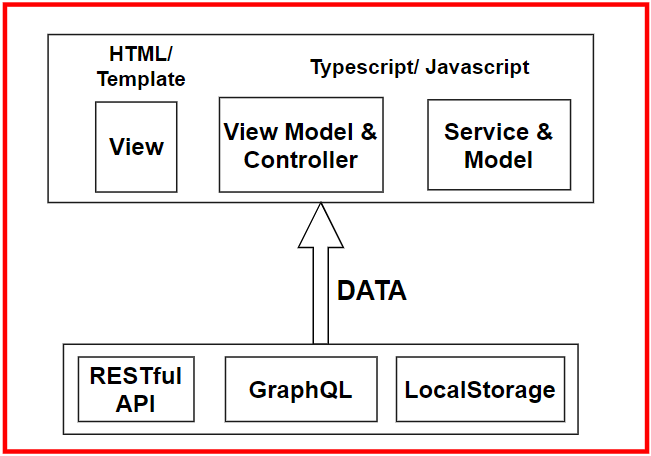
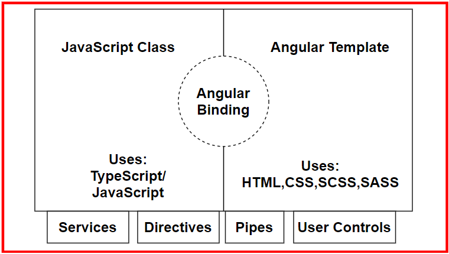

# Introduction to Angular and Its Concepts

### The article will cover some information about the history of web frameworks, Angular and the philosophy behind it, the reactive development paradigm and some features of it.

---

<!-- ## Table of contents:

- React.js library background.
- Advantages of using React.js.
- Principal Hooks overview: -->

## Frameworks - Background information

At first, there was HTML, then DHTML. Technologists invented new technologies like Java, JavaScript, PHP, and many others to deliver interactive experiences over the browser. The goal of the programmers was writing a program once and running it everywhere. At this time, the era of **Single-Page Applications** (SPAs) was born. SPAs tricked the browser into thinking that a single index.html could house entire applications containing many pages. **Backbone.js**, **Knockout.js**, and Angular.js all came and went. Then came React, Angular, and Vue. 
 They promised to fix all problems, bring about universally reusable web components, and make it easier to learn, develop, and scale web applications. And, so they did! Some better than others. The history of the web has taught us a couple of lessons: first, change is inevitable, and second, the developer's happiness is a precious commodity that can make or break entire companies.  
In 2004, the **Asynchronous JavaScript** and **XML** (**AJAX**) technique became very popular in creating websites that did not have to rely on full-page refreshes to create dynamic experiences utilizing standardized web technologies like HTML, JavaScript/ECMAScript, and CSS. 
In 2006, **jQuery** was developed to smooth out the differences between APIs and capabilities for browsers. So instead of repeatedly writing code to check browser versions, you could use jQuery, and you were good to go. It hid away all the complexities of vendor-specific implementations and gracefully filled the gaps when there were missing features. For a good 5 to 6 years, jQuery became the web development framework. To create vibrant user experiences, however, jQuery alone was not enough. Native web applications ran all their code in the browser, which required fast computers to run the dynamically interpreted JavaScript and render web pages. 

>The presentation layer contains user interface (UI) related code, the business layer contains business logic, and the persistence layer contains code related to data storage.
 
>**Model-View-Controller (MVC)** is a typical pattern of code that has data manipulation logic in models, business logic in controllers, and presentation logic in views.

In the early 2010s, frameworks like **Backbone** and **AngularJS** started showing up, demonstrating how to build rich web applications with a native feel and speed to them in a cost-effective way. When we decouple the client from the server via an API, we can enforce the implementation of presentation and business logic separately. Just because the client from the server was separated, we don't end up simplifying the architecture. If anything, the architecture surrounding the presentation logic becomes a lot more complicated. Both the client and server must implement their presentation/API, business, and persistence layers. 
Backbone and AngularJS proved that it was viable to create web applications that run natively in the browser. All SPA frameworks at the time relied on jQuery for DOM manipulation. 
The next generation of web frameworks needed to solve many problems; they needed to enforce good architecture; be designed to evolve with web standards; and be stable and scalable to enterprise needs without collapsing. Also, these new frameworks needed to gain acceptance from developers, who were burned out with too many rapid changes in the ecosystem. Achieving these goals required a clean break from the past, so **Angular** and **React** emerged as platforms to address the problems of the past in different ways.

## Introduction to Angular
Angular is an Open Source JavaScript Framework based on **TypeScript**, Developed by **Google** for web development.  
The new Angular platform is different from the legacy framework you may had heard about in the past. In collaboration with **Microsoft**, Google made TypeScript the default language for Angular. TypeScript is a superset of JavaScript that enables developers to target legacy browsers such as Internet Explorer 11, while allowing them to write modern JavaScript code that works in evergreen browsers such as Chrome, Firefox, and Edge. The legacy versions of Angular, versions in the 1.x.x range, are referred to as AngularJS. Version 2.0.0 and higher versions are called Angular. Where AngularJS is a monolithic JavaScript SPA framework, Angular is a platform that is capable of targeting browsers, hybrid-mobile frameworks, desktop applications, and server-side rendered views.

Angular improves upon AngularJS in every way imaginable. The platform follows **semver** (Sematic Versioning), , where minor version increments denote new feature additions and potential deprecation notices for the second next major version, but no breaking changes. Furthermore, the Angular team at Google has committed to a deterministic release schedule with major versions released every 6 months. After this 6-month development window, starting with Angular 4, all major releases receive LTS with bug fixes and security patches for an additional 12 months. From release to end-of-life, each major version receives updates for 18 months. 
So, what does this mean for you? You can be confident that **your Angular code is supported and backward compatible for an approximate time frame of 24 months** , even if you make no changes to it.
 The Angular team must ensure compatibility through automated tests and make it as painless as possible to move through major releases going forward. In Angular 6, the update process was made much simpler with the introduction of ng update.

 >Beware, looking for Angular help on the web may be tricky. You'll note that sometimes Angular is referred to as Angular 2 or Angular 4. At times, both Angular and AngularJS are referred to as AngularJS. This is incorrect. The naming Angular its for versions 2+ meanwhile AngularJS its for version 1.x.x.

## Why we should use Angular

Your time and code comfort have a lot of value, so you must be careful in choosing the technologies to invest your time in. With this in mind, we need to answer the question of why learn Angular, but not React, Vue, or some other framework? Angular is a great framework to start learning. The framework and the tooling help you get off the ground quickly, it has a vast community and high-quality UI libraries that you can use to deliver exceptional web applications. 
 Angular, React and Vue are great frameworks, with their strengths and weaknesses. Every tool has its place and purpose.
The whole architecture of Angular, which is **component-based**, is one of the most important factors that separate Angular from others. Providing code of higher quality in a proper hierarchy with components as sections with respective functionality.  
Having an application comprised of components as elements come with another advantage of being able to have test Units separately in an efficient method.
Other than these advantages, Angular brings in TypeScript and RxJS library. With its **Hierarchy dependency injection**, applications have better performance, for example using a shared service accross all the application.  
Also, Angular has a massive community of engineers. Since the inception, these communities have provided a wide range of tutorials, documentation, and productive discussions. 
Along with other differences, Angular doesn’t require additional libraries while React asks for them. Angular is full-fledged, while React can be used only for UI development. Angular has a fixed structure, while React is quite flexible and easy to learn.  
Angular is coded using **TypeScript**. It was created by Anders Hejlsberg of Microsoft to address several major issues with applying JavaScript at the enterprise-scale. 
JavaScript is a dynamically interpreted language, where the code you write is parsed and understood by the browser at runtime. Statically typed languages like Java or C# have an additional compilation step, where the compiler can catch programming and logic errors during compile time. 
It is much cheaper to detect and fix bugs at compile time versus runtime. TypeScript brings the benefits of statically typed languages to JavaScript by introducing types and generics to the language. However, TypeScript does not include a compilation step, but instead has a **transpilation** **step**. A compiler builds code into machine language with C/C++ or intermediary language (IL) with Java or C#. A transpiler, however, merely translates code from one dialect to another. So, when TypeScript code is built, compiled, or transpiled, the result is pure JavaScript.

## Basic Angular architecture
Angular follows the MV* pattern, which is a hybrid of the MVC and MVVM patterns. Previously, we went over the MVC pattern. At a high-level, the architecture of both patterns is relatively similar, as shown in the diagram that follows:

The new concept here is the **ViewModel**, which represents the glue code that connects your view to your model or service. In Angular, this glue is known as binding. Whereas MVC frameworks like Backbone or React have to call a render method to process their HTML templates, in Angular, this process is fluid and transparent for the developer. Binding is what differentiates an MVC application from an MVVM one.

Moving forward, the most basic unit of an Angular app is a **component**. It is the combination of a JavaScript class written in TypeScript and an Angular template written in HTML, CSS, and TypeScript. The class and the template are going to be communicated through bindings:

**Classes** are an **Object-Oriented Programming (OOP)** construct. If you invest the time to dig deeper into the OOP paradigm, you are going to improve your understanding of how Angular works vastly. The OOP paradigm allows for the **dependency injection (DI)** of dependent services in your components, so you can make HTTP calls or trigger a toast message to be displayed to the user without pulling that logic into your component or duplicating your code. DI makes it very easy for developers to use many interdependent services without having to worry about the order of instantiation, initialization, or destruction of such objects from memory.  
Angular **templates** also allow similar reuse of code via directives, pipes, user controls, and other components. These are pieces of code that encapsulate highly interactive end user code.

All Angular components, services, directives, pipes, and user controls are organized under **Modules**. Each Angular app is bootstrapped by a root module that renders your first component and injects any services and prepares dependencies it may require. You may introduce **children modules** to enable capabilities like lazy loading so that you don't have to deliver all components of your web application to the browser all at once. 

## The Reactive development paradigm

Angular supports multiple styles of programming. The plurality of coding styles is one of the great reasons why it is approachable to programmers with varying backgrounds. Whether you come from an object-oriented programming background or you're a staunch believer of functional programming, you can build viable apps using Angular.  
As a programmer, you are most likely used to **imperative programming**. You could be using imperative programming when, as the programmer, write sequential code describing everything that must be done in the order that you've defined them and the state of your application depending on just the right variables to be set to function correctly. You write loops, conditionals, and call functions; you fire off events and expect them to be handled. Imperative and sequential logic is how you're used to coding.

**Reactive programming** is a subset of **functional programming**. In functional programming every function you write must stand on its own, receive its own set of inputs and return a result without being influenced by the state of an outer function or class. Functional programming supports **Test Driven Development** (TDD) very well because every function is a unit that can be tested in isolation. As such, every function you write becomes composable. So, you can mix, match, and combine any function you write with any other and construct a series of calls that yield the result you expect. 
Reactive programming adds a twist to functional programming. You no longer deal with pure logic, but an asynchronous data stream that you transform and mold into any shape you need with a composable set of functions.  
Angular makes heavy use of the **RxJS** library, which introduces reactive development patterns to Angular, as opposed to more traditional imperative development patterns.

## RxJS

RxJS stands for Reactive Extensions, which is a modular library that enables reactive programming, which itself is an asynchronous programming paradigm and allows the manipulation of data streams through transformation, filtering, and control functions. You can think of reactive programming as an evolution of event-based programming.