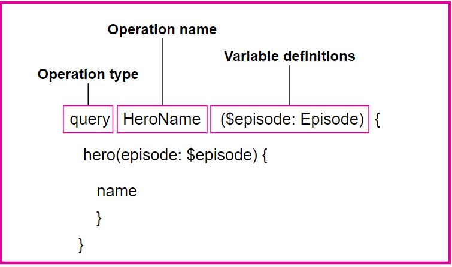
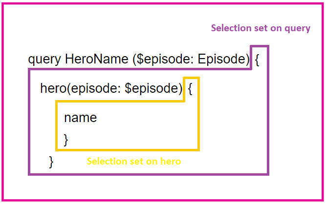

</div>

# GraphQL - What it is and how it works

### I decided to make an overview about basic concepts in order to understand better GraphQL in action.


---

<div>

## A brief history of GraphQL

Facebook created GraphQL in 2012. They needed a better data-fetching approach that they could use across the entirety of the company’s products and services. They also wanted something that was understandable by developers, designers, as well as non-technical roles. </br>
**Facebook open-sourced GraphQL in 2015.**
___

Before we start to talk about GraphQL, I want to do a quick overview of what is SOAP and REST APIs and some other concepts because they are going to be useful to have a better understanding of GraphQL. </br>

The term API is an acronym, and it stands for “Application Programming Interface.”  </br>

**S**imple **O**bject **A**ccess **P**rotocol (SOAP) is a message specification for exchanging information between services and applications. It was a standard that arised in the late 90s to provide the ability to move data between corporate networks. Although it is capable of using HTTP communications, its architecture is not fully aligned with the HTTP protocol. It can also employ other protocols for communication.</br>
SOAP uses XML as the data format for messages being sent and received by an API client.</br>
This protocol provides a much more solid foundation for APIs than REST approach, but it can come with a cost. SOAP can make it slower to evolve and iterate APIs, and it can take longer to onboard new developers who aren’t familiar with SOAP’s older methods. Still, it’s a cost that is worth for backbone applications that a big enterprise depends upon.

**RE**presentational **S**tate **T**ransfer (REST) is a software architectural style that developers apply to web application programming interfaces (APIs). REST APIs are the most common APIs used across the web today because the REST pattern provides simple, uniform interfaces. These can be used to make data, content, algorithms, media, and other digital resources available through web URLs, so that they can be consumed within web, mobile, and device applications. </br>
REST technology is generally preferred than the more robust Simple Object Access Protocol (SOAP) technology because REST uses less bandwidth, is simple and flexible making it more suitable for internet usage. It’s used to fetch or give some information from a web service. All communication done via REST API uses only HTTP request. 


>We should use SOAP when we are designing APIs focused on the message, whereas while using REST we are designing APIs focused on defining them as resources.


## What is GraphQL?

GraphQL is an architectural style for delivering data, and content-focused application programming interfaces (APIs) using HTTP. Borrowing a bite from both SOAP and REST, GraphQL uses HTTP POST methods to submit queries via an HTTP request’s body or query parameters. With the “QL” meaning “query language,” it provides a consistent query layer for APIs, providing a single endpoint for developers to use when making requests. This allows you to not only query the data, but also control the structure of how each GraphQL API responses. </br>
To be more clear **GraphQL is a query language for API’s**. It shows what are the different types of data provided by the server and then the client can pick exactly what it wants. It also provides the capability of handle multiple server resources in one call rather than making multiple REST API calls. </br>

 ## Design your GraphQL schema and ask for exactly what you want

 REST defines how a client and a server can communicate but don't define anything about the data structure of the information exchanged between the client and server. The decision about the data structure is open and usually the backend decides how to send and receive information with the clients. In organized teams, frontend and backend teams can agree about the endpoints and data structure of the API. Anyway, it is not a characteristic of REST APIs but the well-organized teams. In a lot of other situations where we have to use an external REST API we don't know about the data structure until we start using the API.


GraphQL solves that using a strong type system to define the data structure and the information that can be consumed from our clients. All these definitions are written down in a Schema using the GraphQL Schema Definition Language (SDL). Here an example:

 ```graphql
 type Post {
  id: ID!
  title: String!
  body: String!
  user: User!
  comments: [Comment]
}

type Comment {
  id: ID!
  body: String!
  user: User!
}

type User {
  id: ID!
  username: String!
  avatar: String
}

type Query {
  getPosts: [Post]
  getUsers: [User]
}

 ```
On the server, we create a GraphQL schema based on the data we need to build our app UIs. </br>
Finally, write your query, specifying precisely what you’d like to fetch.
Here’s an example of a query using Apollo Studio’s Explorer. Like we used Postman for REST, Apollo Studio’s Explorer is a great way to build out and test your GraphQL APIs.


## GraphQL Runtime

 GraphQL API runs over a HTTP server. In a GraphQL API, we shape our data with a strictly typed schema, telling it how to resolve data when asked for. To GraphQL, where data comes from doesn’t matter. It could be from a database, micro-service, the cloud or even a RESTful API.

## GraphQL Operations

Let's break GraphQL operations down piece-by-piece: **A GraphQL request contains two types of operations and variable definitions:**



* **Operation type:** This is either query, mutation, or subscription. It describes what type of operation you’re trying to do. While all of them look similar in the language, they have slightly different modes of execution on a GraphQL server.
* **Operation name:** For debugging and server-side logging reasons, it’s useful to give your queries meaningful names. That way, when you see something wrong going on either in your network logs or in your GraphQL server, you will know where the error was. You can think this as a function name.
* **Variable definitions:** When you send a query to your GraphQL server, you might have some dynamic parts that change between requests, while the actual query document stays the same. These are the variables of your query. This is where you declare the types of variables you are planning to provide. You can think this as a function parameter.
  



The **selection set** provides to GraphQL his recursive nature, allowing to do nested data fetching and avoiding to use multiple request to the server. </br>
A GraphQL query must contain a selection set on any field that returns an object type.</br>


>Queries that fetch data are synonymous to ``GET`` calls in REST, while mutations invoke a change in the system, similar to REST’s ``POST`` or ``DELETE`` methods.

 ## GraphQL usages examples

 * **Pulling Data:**
    When developers need to pull data from the backend, it’s typically called a GET request in REST terms. With GraphQL, these are queries that look like this:
``` graphql
    query GetTitles {
  allBooks {
    books {
      # retrieves title of all books
      title
    } 
  }
}
```
In this case the response could be smilar to this:
```json
{
  "data": {
    "allBooks":  [
      {
        "title": "The Martian"
      },
      {
        "title": "The Great Gatsby"
      }
    ]
  }
}
```

* **Editing Data:**
  If developers need to add, modify, or delete data, they’ll send a POST, PUT/PATCH, or DELETE request to a REST endpoint. With GraphQL, however, modifying data requires a ``mutation`` request. Here’s an example of creating a mutation:

  ```graphql
  mutation createBook(title: "The Old Man and the Sea", author: "Ernest Hemingway") { }
  ```

  This simple mutation will create a new book object on the backend with the specified title and author. If the mutation was successful, we’d get a response that includes a unique identifier for the new data object created on the backend.

  ```json
  { "data": { "createBook": "sqdYsdf" } }
  ```
</br>

* **Subscription for Data:**
  
GraphQL supports subscriptions , which enable a frontend app to retrieve real-time data updates from the server. Subscriptions are made majorly to listen to when the data is created on the server, updated, deleted, or read via a query. The event emitted dependens on what the dev wants. The events are pushed from the server to the subscribing clients. For example, if a frontend app needed to keep a running list of books as they’re added to its database, developers could set up a subscription event using the following request: 

```graphql

subscription {
  new_books {
    id
    title
    author
    date_added
  }
}

```

 ## GraphQL advantages

Many development teams still opt for REST APIs when integrating new frontends with their clients because it’s an API paradigm they’ve been familiar with for a while. GraphQL, however, is ideal because it simplifies development, reducing bandwidth usage, and the time-to-market for content-driven apps.</br>

REST doesn't force you to create documentation about the API. There are tools like Swagger that helps developers to create REST APIs documentation. However, it requires an extra effort for the developer to create and maintain it. For that reason there are a lot of REST APIs with no documentation or with outdated documentation. </br>
Due to the use of a string type system, GraphQL is a documented language by definition. So, only by creating our GraphQL Schema we are generating our API documentation.
For this article, I want to add a personal example: </br>

I'm using Gatsby with some plugins, React.js and GraphQL. Here there is an example of a GraphQL query to retrieve the latest posts. All the data retrieved can be used inside an React Component.

```graphql
    query BlogMetada {
      allMarkdownRemark(
        sort: { order: DESC, fields: frontmatter___date }
      ) {
        nodes {
          id
          frontmatter {
            title
            date(formatString: "DD MMMM, YYYY")
            slug
            subtitle
            author
            coverImage {
              childImageSharp {
                gatsbyImageData(
                  width: 100
                  blurredOptions: { width: 50 }
                  placeholder: BLURRED
                )
              }
            }
            cardImage {
              childImageSharp {
                gatsbyImageData(
                  blurredOptions: { width: 50 }
                  placeholder: BLURRED
                )
              }
            }
          }
        }
      }
    }
```
As you can see, rather than designing individual API paths/calls for each resource, GraphQL gives you a single URL to query the data you desire as the client. It provides a language for making requests of the data, while also describing the structure of the data being returned. It allows you to precisely define the schema of the data you are making available, then gives you a powerful query interface to navigate, traverse, and discover what you need.

## Conclusion

We have seen what is GraphQL and the advantages of it over different architectural styles for delivering data. GraphQL empowers frontend developers to be more agile and precise on how they deliver data and content to web and mobile applications. This provides a robust way to query data using a single HTTP URL, allowing developers to completely shape the structure of each API request and optimize the data that is returned. It's awesome how it brings to the developers the capability of create, read, update, and delete data across large graphs of interconnected data that have all of the relationships defined and mapped.

**If you have any questions or want to contribute something to this article, please leave it in the comments.**