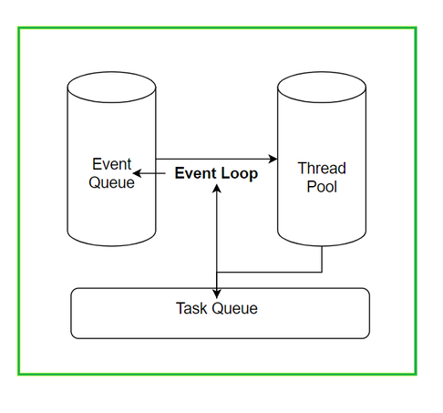
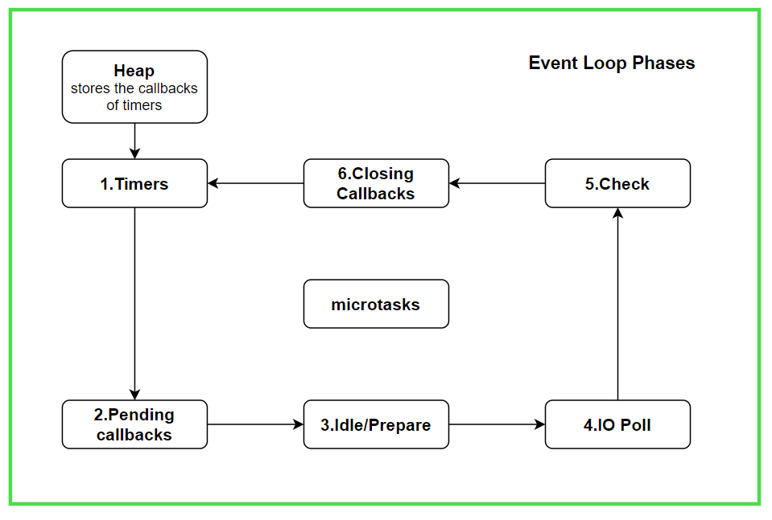

# Node.js - How Node works under the hood.


## > What is Node.js?:

> Node.js is a single-threaded event-driven platform that is capable of running non-blocking, asynchronously programming.


Node.js runs the **V8** JavaScript engine, the core of Google Chrome, outside of the browser. This allows Node.js to be very performant.
V8 provides the runtime environment in which JavaScript executes. The DOM, and the other Web Platform APIs are provided by the browser.

JavaScript is generally considered an **interpreted language**, but modern JavaScript engines no longer just interpret JavaScript, they compile it. JavaScript is internally compiled by V8 with just-in-time (JIT) compilation to speed up the execution.

**A Node.js app runs in a single process**, without creating a new thread for every request. Node.js provides a set of asynchronous I/O primitives (libuv) in its standard library that prevent JavaScript code from blocking and generally. **We can understand node as a synchronous lenguage that can be written asynchronous**.


## > The Node.js Event Loop:


The first thing needed in order to understand the Event Loop is an understanding of the **event-driven programming paradigm**.
Defined simply: is application flow control that is determined by events or changes in state. The general implementation is to have a central mechanism that listens for events and calls a callback function once an event has been detected (i.e. state has changed). This is the basic principle behind Node's Event Loop.


The Event Loop is one of the most important aspects to understand about Node.js, because it explains how Node.js can be asynchronous and have non-blocking Input/Output, the thing that made it this successful. Node.js JavaScript code runs on a single thread. **There is just one thing happening at a time**.

**The Event Loop allows Node.js to perform non-blocking I/O operations despite the fact that JavaScript is single-threaded.**

Lets take a look to the behaviour of the following code:

```javascript

console.log('Hello');

const url = 'http://example.com';

 function request(url, (data) => {
   console.log(data);
 });
 
 console.log('World')

```

The console will display:

```
Hello
World
{some:"json"}
```
In order to understand why the callback inside the request function is executed at last, we need to know that Node.js works with a Call Stack called ``Event Queue``, the ``Event Loop``, a ``Task Queue`` and it also uses a ``Thread Poll`` to handle async processes. 

- **Event Queue:** The main Call Stack of Node. Its going to stack all the functions that are going to be executed. Its primoridal to avoid to block this particualr stack.
- **Event Loop:** Its an almost an infinite loop used by Node to supervise if there's something in the **Event Queue** or **Task Queue**, and executes it. It executes processes from the Task Queue only when the Event Queue is empty. The Event Loop executes the tasks starting from the oldest first.
- **Task Queue:** This stack will be filled when inside any of the Thread polls an async function or process is finished. For example a call to an API or a ``setTimeout`` (timer) function.
- **Thread Poll:** Whenever Node finds an async process inside the Event Queue, it's going to move that function to a different stack to track the callback, also it's going to execute an error if its the case. Each phase of the Event Loop will have a Thread Poll.
  




For our example, at the beggining of the code, the first ``console.log('Hello')`` its going to be executed immediately, after that the url const value is saved. Then we have a call to an API, as this function contains a callback its going to be handle different: Node will run the **Thread Poll** and add this callback there in order to not block the **Event Queue** execution time. The call to the API has been triggered and in some point will finish, the **Event Queue** is still running and its going to print in console ``World``. When the call to the API finish, the callback will be moved to the **Task Queue**, the **Event Loop** will execute the logic inside the callback because there's nothing on the **Event Queue** to execute, returning the data in the console.


## > Event Loop phases:
The Event Loop is basically a mechanism which works using phases through which it iterates if there's something that needs to be executed, thats why we can say that the Event Loop its almost an infinite loop, if the Event Queue is empty the Event Loop will turn off until something fills the Event Queue. 



**Each of the phases has a queue/heap which is used by the Event Loop to push/store the callbacks to be executed**. Its not true that Node.js only uses one single queue where all the callbacks are stored.

### **1. Timers:**
    
   The callbacks of timers in JavaScript (setTimeout, setInterval) are kept in the timers heap meamory in order to track the expired times. A timer specifies the threshold after which a provided callback may be executed rather than the exact time a person wants it to be executed. Timers callbacks will run as early as they can be scheduled after the specified amount of time has passed. The execution of the timer callbacks is handle by the Poll Phase. 


### **2. Pending callbacks:**

I/O callbacks that were previously deferred to the next loop iteration are executed during this phase. This phase executes callbacks for some system operations, such as types of TCP errors.


### **3. Idle/Prepare:**

This phase is only used by Libuv internally to be prepared for the next phases.

### **4. Input/Output Poll:**

In this phase, the Event Loop watches out for new async I/O callbacks. Nearly all the callbacks except the setTimeout, setInterval, setImmediate and closing callbacks are executed, because those are all handled in different phases.
**The Event Loop does two things in this phase:**
- If there are already callbacks queued in the poll phase heap, it will execute them untill the poll phase callback queue is clean.
- If there are no callbacks in the queue, the Event Loop will stay on this phase for a certain amount of time depending on:
  
  If there are any callbacks present in the setImmediate queue to be executed, the Event Loop will move to the fifth phase called check/setImmediate.

  If the Event Loop knows that there are expired timers, the Event Loop will move to the next phase (Check/setImmediate) and then to the Closing callbacks phase and will eventually start its next iteration from the timers phase. This could introduce some delay of execution for the timers.

### **5. Check/setImmediate:**

In this phase, the Event Loop takes the callbacks from the Check phase's queue and starts executing one by one until the queue is empty. The Event Loop will come to this phase when there are no callbacks remaining to be executed in the poll phase and when the poll phase becomes idle. Generally, the callbacks of setImmediate are executed in this phase.

### **6. Closing callbacks:**

 In this phase, the Event Loop executes the callbacks associated with the closing events like ``socket.on('close', fn)`` or ``process.exit()``. If there's nothing here or if the queue was drained it will move to the next iteration startng from timers. 


 >**Apart from all these, there is one more microtask queue which contains callbacks associated with** ``process.nextTick`` **and Promises callbacks that will be covered later on this post.**
 >The process.nextTick comes under microtasks which are prioritised above all other phases and the callback associated with it is executed just after the event loop finishes the current operation. Which means that, whatever callback we pass to ``process.nextTick``, the event loop will complete its current operation and then execute callbacks from the microtasks queue until it is drained up. Once the queue is drained up, it returns back to the phase where it left.

## > setImmediate() vs setTimeout()
``setImmediate()`` and ``setTimeout()`` are similar, but are handle in different ways by the Event Loop.
``setImmediate()`` is designed to execute a script once the current Poll Phase completes.
``setTimeout()`` schedules a script to be run after a minimum threshold in ms has elapsed.

Lets take a look to the following example:

```javascript
function test() {
  setTimeout(() => console.log('a'), 10);
  process.nextTick(() => console.log('b'));
  setImmediate(() => console.log('c'));
  process.nextTick(() => console.log('d'));
}

test();
```
console result:

```
b
d
c
a
```

The Event Loop its going to check the ``microtask queue`` and executes the callbacks in it(process.nextTick callbacks in this case).
It then goes to the ``Check/setImmediate`` phase where it sees the timer expired and executes the callback which logs '3'.
In the next iteration of the event loop, it sees the timer of 50ms expired and logs down 1.

## > The Event Loop and Promises

In order to understand more and more about how Node.js works under the hood, lets take a look to how the promises are handled by the Event Loop.
Promises were created to avoid ``callbacks hell``

>We can define a Promise as an object that can produce a single value at some point in the future, either a value or the reason why it could not been resolved.


ES6 Promise Syntax
```javascript
const promise = new Promise(function(resolve, reject) {
    return setTimeout(function() { 
        resolve(1); 
    }, 10000);
});
promise.then(function(value) { 
     console.log(value) 
});

// 1
```

All the promises can be in three different states: resolved, rejected or pending. For each process we can attach a callback using the ``then`` method.
The execution of the Promises and their “callbacks” is different from the asynchronous callbacks that we saw in the previous examples because the Promises callbacks are added to the ``microtask`` queue, meaning that Event Loop will handle those promises in the same way of process.nextTick.
**From this moment we can differentiate between two types of asynchronous tasks:**

* Macrotasks: ``setTimeout``, ``setInternal``, ``setImmediate``,`` I/O tasks``
* Micro: ``process.nextTick``, ``Promises``

For each tick of the Event Loop one macrotask is completed out of the macrotask queue. After that macrotask is complete, the event loop visits the microtask queue. The entire microtask queue is completed before moving on.

**To sum up how the Event Loop handles macro and micro tasks:**

> 1- It will check if there is any task available in the macrotasks queue.
>
> 2- If so and this task is running, wait until it is completed before going to the next step. If  not, go directly to step 3.
> 
> 3- Then run all the microtasks that are in the microtask queue.
> 
> 4- If new microtasks where added during the execution of the microtasks, they are also executed.

**Two macrotasks cannot be executed one after the other if, in between, the microtasks stack has elements.**

  Lets take a look to this following example:


```javascript
console.log('start');
setTimeout(function() {   
  console.log('timeout finished'); 
}, 0);
Promise.resolve()
  .then(function() {   
    console.log('promise 1'); 
  })
  .then(function() {   
    console.log('promise 2'); 
  });  
console.log('end');
```

```
 start
 end
 promise 1
 promise 2
 timeout finished
```
You can see how timeout finished is written at the end, because is treated as a macrotask so that at the end the enqueued microtasks are executed, the two console.log referring to the callbacks of the promises.


## > Async/Await Function

Async/Await enables us to write asynchronous code in a synchronous, which produces cleaner and easier-to-understand logic. Under the hood, Asyn/Await will be handle as a promise using JS generators.
By wrapping the logic inside an async function, we can replace the ``then`` callbacks with ``await`` statements. The code **pauses execution** on those lines until the Promises resolve.

Async/Await Syntax

```javascript
// Handle fetch with async/await
async function getUser() {
  const response = await fetch('https://api.github.com/users/octocat')
  const data = await response.json()

  console.log(data)
}

// Execute async function
getUser()
```

We can also handle the error within the function. Instead of using the catch method with then, you will use the try/catch pattern to handle the exception.
```javascript
async function getUser() {
  try {
    // Handle success in try
    const response = await fetch('https://api.github.com/users/octocat')
    const data = await response.json()

    console.log(data)
  } catch (error) {
    // Handle error in catch
    console.error(error)
  }
}
```

## Conclusion

Because Web APIs often provide data asynchronously, learning how to handle the result of asynchronous actions is an essential part of being a JavaScript developer. In this article, you learned how the host environment uses the event loop to handle the order of execution of the code.
We cover a high level Event Loop architecture explaination, the phases of the Event Loop, callbacks, macrotasks, microtasks, promises, and async/await syntax. Finally, you used the Fetch Web API to handle asynchronous actions.
Therefore, I hope this article has helped you to review or discover all these types of concepts that some times makes Node.js a blackbox.

**If you have any questions or want to contribute something to this article, please leave it in the comments.**
